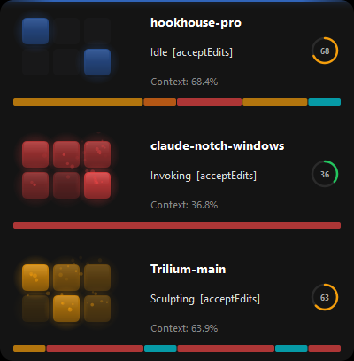
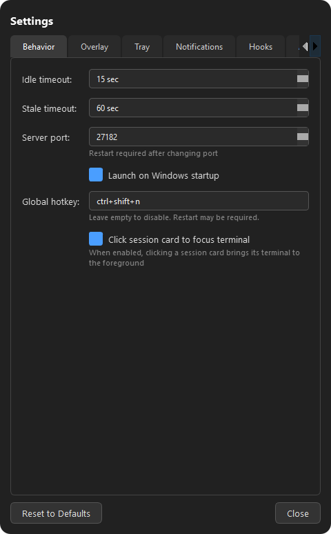
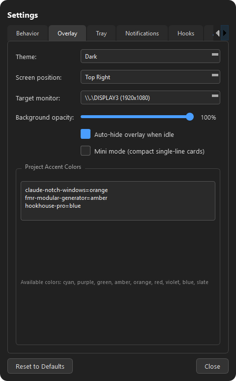

# Claude Code Notch for Windows

A Windows companion app for Claude Code CLI that displays real-time AI activity in your system tray and floating overlay. Built entirely with [Claude Code](https://claude.com/claude-code).



## Features

- **System Tray Integration** - Always-visible status indicator with color-coded activity and dirty-check caching
- **Floating Overlay Window** - Animated activity display with session cards, fade-in/out transitions, and draggable positioning with bounds-checking
- **Real-time Activity Tracking** - See what Claude is doing (Reading, Writing, Executing, etc.)
- **"Thinking" State** - Shows fun verbs (Pondering, Noodling, Percolating...) between tool calls instead of flashing idle
- **Timeline Strip** - Recent tool history shown as colored blocks on each session card
- **Attention Levels** - Configurable opacity ranges (peripheral/ambient/focal/urgent) per activity category
- **Duration Evolution** - Animations gradually slow down for long-running tools (normal -> extended -> long -> stuck)
- **Context Progress Bar** - Threshold-colored bar (green/amber/red) showing context window usage with cached token support
- **Permission Mode Badge** - Shows current permission mode (plan, acceptEdits, etc.) in overlay status
- **Notification Balloons** - Tray balloon notifications for Claude Code notification events
- **Webhook Notifications** - Discord/Slack webhook support for errors, attention requests, and session end events
- **Sound Cues** - Optional audio alerts for ambient event awareness
- **Session Management** - Pin/unpin sessions for persistent display
- **Click-to-Focus** - Click a session card to bring its terminal window to the foreground
- **Mini Mode** - Compact single-line session cards for minimal screen footprint
- **Multi-Monitor Support** - Choose which monitor to display the overlay on
- **Per-Project Accent Colors** - Assign distinct colors to different projects
- **Theme Presets** - Dark and Light theme modes
- **Global Hotkey** - Configurable keyboard shortcut to toggle the overlay
- **Session Statistics** - Track tool counts and category time per session
- **Settings Dialog** - Dark-themed settings with 7 tabs and live preview
- **Semantic Design System** - Color-coded activities with glow, particles, and smooth animations
- **Status API** - `/status` endpoint returning real-time session data as JSON
- **Test Suite** - Unit tests covering state management, settings, notifications, and more

## Installation

### Requirements

- Windows 10/11 or Windows Server 2019+
- Python 3.8 or higher
- Claude Code CLI installed

### Setup

1. **Install Python dependencies:**
   ```bash
   pip install -r requirements.txt
   ```

2. **Run the application:**
   ```bash
   python src/main.py
   ```

3. **Install Claude Code hooks:**
   - Right-click the system tray icon
   - Select "Setup Hooks" (or open Settings > Hooks tab)
   - This will configure Claude Code to send events to the Windows app

## Usage

### System Tray

The app runs in your system tray and shows:
- **Icon Color** - Current activity type (orange=thinking, cyan=reading, green=writing, etc.)
- **Category Letter** - First letter of the activity category on the icon (configurable)
- **Tooltip** - Current tool and project info
- **Context Menu** - Access settings, overlay toggle, and setup

### Overlay Window

The floating overlay shows detailed activity:
- **Session Cards** - One card per active Claude session
- **Activity Indicator** - 3x2 grid animation showing current pattern
- **Project Info** - Current project name and working directory
- **Tool Status** - What Claude is currently doing

**Controls:**
- **Double-click tray icon** - Show/hide overlay
- **Drag overlay** - Reposition the window (stays in place across updates, clamped to screen edges)
- **Right-click tray** - Access menu
- **Reset Position** - Right-click tray menu option to snap overlay back to configured corner

### Settings

Right-click the tray icon and select **Settings** to open the settings dialog. Changes apply immediately.

|  |  |
|:---:|:---:|
| Behavior tab | Overlay tab |

| Tab | Settings |
|-----|----------|
| **Behavior** | Idle timeout, stale timeout, server port, launch on startup, global hotkey, click-to-focus |
| **Overlay** | Theme, screen position (4 corners), target monitor, background opacity, auto-hide, mini mode, per-project accent colors |
| **Tray** | Show/hide category letter on tray icon |
| **Notifications** | Desktop toast notifications, sound cues |
| **Hooks** | Hook install status, install/uninstall buttons, file paths |
| **Animations** | Enable/disable animations, speed multiplier, glow effects |
| **Stats** | Session statistics and tool usage data |

Settings are saved to `%APPDATA%\claude-notch-windows\settings.json` and persist across restarts.

### Custom Commands

Once hooks are installed, you can use these commands in Claude Code:

```bash
# Pin current session to always show in overlay
/send-to-notch

# Unpin all sessions
/remove-from-notch
```

## Activity Colors

The app uses a semantic color system:

- **Cyan** (Observe) - Reading, searching (Read, Glob, Grep)
- **Orange** (Think) - Processing, reasoning (also used for "Thinking" grace period between tools)
- **Green** (Create) - Writing new files (Write)
- **Amber** (Transform) - Editing existing files (Edit)
- **Red** (Execute) - Running commands (Bash)
- **Violet** (Connect) - External APIs, web (WebFetch, WebSearch)
- **Blue** (Interact) - Needs attention (AskUserQuestion)
- **Gray** (Idle) - No current activity

## Configuration

The app has two layers of configuration:

- **`config/notch-config.json`** - Visual design system (tool names, categories, colors, animation patterns). This is the design config and not intended for end-user editing.
- **`%APPDATA%\claude-notch-windows\settings.json`** - User preferences (timeouts, position, opacity, etc.). Managed through the Settings dialog.

## File Structure

```
claude-notch-windows/
├── src/
│   ├── main.py                # Application entry point
│   ├── http_server.py         # HTTP server for receiving events
│   ├── state_manager.py       # Session and tool state management
│   ├── tray_icon.py           # System tray icon
│   ├── overlay_window.py      # Floating overlay UI
│   ├── settings_dialog.py     # Dark-themed settings dialog (7 tabs)
│   ├── user_settings.py       # User preferences persistence
│   ├── setup_manager.py       # Hook installation
│   ├── themes.py              # Theme presets and stylesheet generation
│   ├── hotkey_manager.py      # Global hotkey registration
│   ├── window_focus.py        # Click-to-focus terminal window logic
│   ├── session_stats.py       # Session statistics tracking
│   ├── notification_manager.py # Desktop toast and sound notifications
│   └── webhook_dispatcher.py  # Discord/Slack webhook integration
├── hooks/
│   ├── notch-hook.py          # Main event hook (Python, primary)
│   ├── send-to-notch.py       # Pin session command (Python)
│   ├── remove-from-notch.py   # Unpin command (Python)
│   ├── notch-hook.ps1         # Main event hook (PowerShell fallback)
│   ├── send-to-notch.ps1      # Pin session command (PowerShell fallback)
│   └── remove-from-notch.ps1  # Unpin command (PowerShell fallback)
├── tests/                     # Unit tests (pytest)
├── config/
│   └── notch-config.json      # Semantic design configuration
├── screenshots/               # Screenshots for README
├── pytest.ini                 # Pytest configuration
├── main.spec                  # PyInstaller build spec
├── requirements.txt           # Python dependencies (PySide6, pytest)
└── README.md
```

## How It Works

1. **Claude Code** executes hook scripts on various events (PreToolUse, PostToolUse, Notification, etc.)
2. **Hook scripts** send JSON payloads to `http://localhost:27182` (Python hooks by default for ~50-200ms startup; PowerShell fallback if needed)
3. **HTTP server** receives events, dispatches to state manager via thread-safe Qt Signal bridge (`_EventBridge`), and serves `/status` API
4. **State manager** updates session states, applies a 3-second grace period ("Thinking" state) between tools, tracks attention levels and duration evolution, and emits Qt signals
5. **UI components** (tray icon, overlay) react to state changes — tray uses dirty-check caching, overlay uses fade animations and bounds-clamped dragging

## Security and Privacy

This app runs entirely on your local machine:

- **No external network connections by default** - The HTTP server listens only on `localhost:27182`. No telemetry or analytics. The only optional outbound connection is Discord/Slack webhooks if you configure them in Settings > Notifications.
- **No credentials accessed** - The app does not read or store any API keys, tokens, or passwords.
- **Local file access only:**
  - Reads `~/.claude/settings.json` to install/check hooks
  - Reads/writes `%APPDATA%\claude-notch-windows\` for settings, logs
  - Optionally writes to `HKCU\Software\Microsoft\Windows\CurrentVersion\Run` if you enable launch-on-startup
- **Source code is fully open** - Review every line at the repo link above.
- **No code execution** - The app only *observes* Claude Code activity via hook events. It does not execute, modify, or intercept any Claude Code operations.

If you download a pre-built `.exe`, you can verify it by building from source yourself (see below).

## Troubleshooting

### Hooks not working

1. Check that hooks are installed: Right-click tray > Settings > Hooks tab
2. Verify `~/.claude/settings.json` contains hook entries
3. Check logs: `%APPDATA%\claude-notch-windows\logs\claude-notch.log`

### Server won't start

- The app uses port binding as single-instance enforcement — if port 27182 is in use, it means another instance is already running
- Run `netstat -ano | findstr :27182` to find conflicting processes
- Change the port in Settings > Behavior tab (restart required)

### Overlay not showing

- Check if you have active Claude Code sessions
- Overlay auto-hides when idle (configurable in Settings > Overlay)
- Double-click tray icon to manually show/hide
- Try disabling auto-hide in Settings > Overlay

## Development

### Running from source

```bash
# Install dependencies
pip install -r requirements.txt

# Run application
python src/main.py
```

### Running tests

```bash
pip install pytest
python -m pytest tests/ -v
```

### Building standalone executable

```bash
pip install pyinstaller

# Build using the included spec file
pyinstaller main.spec
```

The built executable will be in `dist/ClaudeNotch.exe`.

## Credits

Inspired by [cookinn.notch](https://github.com/cookinn/notch) for macOS by [@cookinn](https://github.com/cookinn). This is a Windows adaptation using PySide6 (Qt 6), maintaining the same semantic design philosophy.

Built with [Claude Code](https://claude.com/claude-code).

## License

MIT License - see LICENSE file for details.

## Contributing

Contributions welcome! Please open an issue or PR on GitHub.
